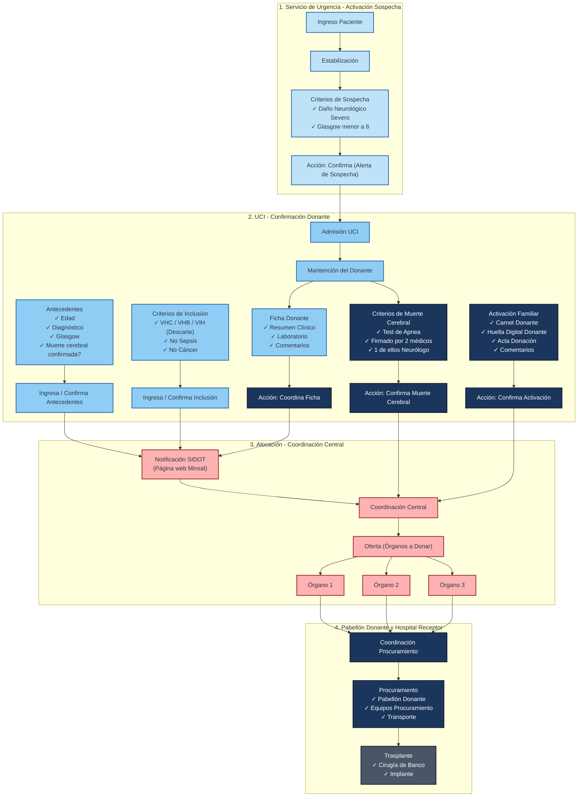

# Trasplan - Sistema de Gestión y Coordinación de Procuramiento de Órganos

Trasplan es una plataforma web y móvil diseñada para coordinar y gestionar el proceso de procuramiento y trasplante de órganos en tiempo real. Facilita la comunicación entre los centros médicos, los médicos de la Unidad de Cuidados Intensivos (UCI), los coordinadores de trasplantes y los procuradores para optimizar la detección, evaluación, activación familiar, asignación y cirugía de órganos de donantes potenciales.

---

## Arquitectura y Estructura del Proyecto

El repositorio está dividido en cuatro componentes principales:

1. **backend/**: Servidor de base de datos y API GraphQL (Node.js + Express + Apollo Server v4 + Sequelize + TypeScript).
2. **web/**: Panel administrativo y operacional web (React + Material-UI v4 + Apollo Client v3 + TypeScript).
3. **App/**: Aplicación móvil nativa moderna (React Native CLI + TypeScript).
4. **mobile/**: Versión móvil antigua/legada basada en Expo (Expo SDK 37 + JavaScript).

---

## Historial de Desarrollo

El desarrollo de la plataforma Trasplan ha seguido un proceso interdisciplinario y colaborativo entre las Facultades de Medicina e Ingeniería de la Pontificia Universidad Católica de Chile:

* **Etapa I (2020) - Concurso Interdisciplina VRI UC**: Conceptualización inicial y codiseño del proyecto liderado por el Dr. Briceño, Dr. Achurra, Dr. Neyem y S. Riveros.
* **Etapa II (2021) - Curso Capstone UC**: Diseño e implementación de las funcionalidades esenciales de **Sospecha** y **Activación de donante**.
* **Etapa III (2022) - Curso Capstone UC**: Expansión del sistema para incorporar la **Alocación de órganos** y la **Gestión de procura**.
* **Etapa IV (2022) - Postulaciones FONIS**: Postulación a fondos concursables FONIS 2022 y FONIS 2023 (no adjudicados).
* **Etapa V (2023–2024) - Consolidación**: Finalización del desarrollo informático y estabilización de la plataforma.

---

## Dominio de Negocio y Flujo de Procuramiento

El sistema modela el ciclo de vida completo de un potencial donante de órganos, desde la sospecha inicial hasta el trasplante definitivo. El diseño de Trasplan aborda de forma directa los problemas históricos detectados en el proceso de procuramiento en Chile:

* **Fase de Detección**: Retraso u omisión en la notificación. Para mitigar esto, según la Ley de notificación obligatoria de potencial donante, el sistema permite que cualquier médico inicie una alerta de **Sospecha** en terreno al detectar un paciente con daño neurológico severo y puntaje de Glasgow < 8.
* **Fase de Mantenimiento**: Falta de coordinación de equipos de procura, logística de traslado y control del tiempo de isquemia fría. Trasplan centraliza la información para eliminar la "información limitada" durante la cirugía de procura y optimiza la comunicación.
* **Fase de Trasplante**: Pérdida de órganos viables debido a expiración de tiempos de isquemia o ineficiencias en la asignación.

El flujo de procuramiento modelado en el sistema se describe a continuación:



### Módulos y Modelos de Datos

* **User / Workplace / MedicalCenter**: Gestión de usuarios (médicos, coordinadores, procuradores), sus lugares de trabajo y los centros de salud asociados.
* **Suspicion (Sospecha)**: El registro inicial de un donante potencial en el hospital de origen (identificado por su RUT único y sexo). Habilitado por el botón de pánico en la app móvil.
* **InclusionCriteria**: Cuestionario para verificar si el paciente cumple los requisitos médicos y legales para ser donante (descarte de infecciones como VIH, VHB, VHC, o condiciones como Sepsis y Cáncer).
* **MedicalRecord / Background**: Ficha médica con características físicas básicas (peso, estatura, grupo sanguíneo) y antecedentes de salud (enfermedades crónicas, infecciones, hábitos).
* **BrainDeath**: Registro de pruebas clínicas (como test de apnea, reflejos del tronco encefálico y electroencefalograma) para verificar formalmente la muerte cerebral por parte de 2 médicos (uno de ellos neurólogo/neurocirujano).
* **FamilyActivation / Confirmation / Negation**: Registro de la entrevista familiar, capturando el consentimiento (detallando qué órganos se autoriza donar) o la denegación (con motivos como motivos religiosos, culturales, etc.).
* **Organ / OrganType**: Órganos del donante aptos para procuramiento (corazón, hígado, riñones, etc.), con su tiempo de isquemia específico.
* **Offering (Oferta)**: Oferta de un órgano a centros médicos receptores compatibles de manera secuencial y priorizada.
* **Surgery (Cirugía)**: Planificación de la extracción en pabellón, coordinando el equipo quirúrgico y la hora crítica de clampeo.
* **HistoryItem / ExpoDeviceToken**: Auditoría de cada acción ejecutada en las sospechas y tokens para notificaciones push en dispositivos móviles.
* **Statistics**: Módulo de analítica que proporciona visualizaciones y métricas regionales demográficas, rendimiento e indicadores de donantes y traslados por centro asistencial.
* **ClinicalSupport & EducationalTools**: Herramientas complementarias para el personal clínico que incluyen guías clínicas de mantención de donantes (preservación en UCI), educación interactiva sobre donación para profesionales y guías de apoyo familiar para entrevistas sensibles.

---

## transiciones de Ciclo de Vida y Transiciones

Tanto las sospechas de donantes (Suspicion) como los órganos (Organ) y las ofertas (Offering) poseen flujos de estado rigurosos:

### 1. Estados de una Sospecha (Suspicion)
* **Sospecha**: Registro inicial. Se crea de manera predeterminada junto con formularios vacíos de criterios, antecedentes, ficha médica, muerte cerebral y activación familiar.
* **Activo**: El donante potencial cumple con los criterios iniciales.
* **Confirmado**: Tras completar y validar todos los formularios obligatorios, la sospecha es confirmada por el coordinador de trasplantes.
* **Alocacion**: Se han registrado órganos disponibles y se han abierto ofertas a otros hospitales.
* **Cirugia**: Se ha programado la cirugía de extracción en pabellón.
* **Trasplantado**: Cierre del ciclo de procuramiento (cuando todos los órganos de la sospecha han sido trasplantados o formalmente desestimados).
* **Desestimado / Descartado**: El caso es cancelado o rechazado debido a razones médicas o por denegación familiar.

### 2. Estados de un Órgano (Organ)
* **Pendiente**: Registrado pero sin ofertas activas.
* **Alocando**: Ofertas activas en curso hacia hospitales receptores.
* **Asignado**: Una oferta fue aceptada por un hospital receptor y asignada por el sistema.
* **InicioProcura**: Comienzo del procedimiento quirúrgico específico para este órgano.
* **CrossClamp / En isquemia**: Clampeo aórtico aplicado; comienza a correr el tiempo de isquemia fría.
* **FinalProcura**: Extracción quirúrgica finalizada.
* **Trasplantado**: Trasplantado exitosamente en el receptor en el hospital destino.
* **Desestimado**: Órgano descartado durante el proceso debido a inviabilidad médica sobrevenida u otros problemas técnicos.

### 3. Estados de una Oferta (Offering)
* **Pendiente**: Esperando respuesta del centro receptor prioritario.
* **Aceptada**: El centro receptor aceptó la oferta del órgano.
* **Rechazada**: El centro receptor rechazó el órgano (lo que activa automáticamente al siguiente centro en la cola de prioridad).
* **Expirada**: El tiempo de espera límite del centro receptor expiró sin una respuesta.

---

## Reglas de Negocio Clave

### Criterios de Confirmación de Sospecha
Para que una sospecha (Suspicion) pueda ser confirmada (habilitando la oferta de sus órganos), debe cumplir con cinco requisitos obligatorios que deben estar presentes y formalmente confirmados por personal autorizado:
1. **Antecedentes Médicos (Background)**: Confirmado.
2. **Criterios de Inclusión (InclusionCriteria)**: Confirmado.
3. **Ficha Médica (MedicalRecord)**: Confirmado.
4. **Muerte Cerebral (BrainDeath)**: Confirmado.
5. **Activación Familiar (FamilyActivation)**: Confirmado (con consentimiento positivo de donación).

El backend expone `enableToConfirm` que valida que estas 5 relaciones tengan `confirmation.status === true`.

### Cola de Ofertas y Expiración Automatizada
Cuando se ofrece un órgano (`createOffering`), se puede ingresar una lista priorizada de hasta 5 centros médicos (`medicalCenterIds`):
* La oferta número 1 de la lista se activa inmediatamente (`activeDate = new Date()`).
* El backend utiliza un job programado (`node-schedule`) con una expiración de 1 hora por defecto.
* Si el centro médico actual no responde a tiempo, la oferta expira y el sistema activa de forma secuencial la siguiente oferta (prioridad `priority + 1`) actualizando su `activeDate`.
* Si un centro Acepta, se cancelan (expiran) el resto de las ofertas y el órgano pasa a estar Asignado al hospital que aceptó.
* Si todas las ofertas de la cola son Rechazadas o Expiran, el estado del órgano regresa a Pendiente y se eliminan las ofertas activas para permitir una nueva ronda de asignación.

### Control del Tiempo de Isquemia Fría
Cuando se efectúa el clampeo aórtico (`crossClamp` en `Surgery`), se propaga este timestamp a todos los órganos asociados:
* Cada tipo de órgano (`OrganType`) posee un límite de isquemia máximo permitido (`ischemiaTime` en horas; ej. el corazón tiene pocas horas de viabilidad, mientras que los riñones tienen mayor margen).
* El sistema calcula el tiempo límite de viabilidad: `crossClamp + ischemiaTime`.
* Utilizando la librería `countdown`, el panel web muestra un reloj regresivo dinámico formateado en español (ej. "2 horas, 14 minutos") indicando el tiempo de isquemia fría restante.
* Si el tiempo actual sobrepasa el límite calculado, el estado del temporizador se muestra como "Tiempo de isquemia finalizado".

### Notificaciones Push en Dispositivos Móviles
El backend integra el SDK de Expo (`expo-server-sdk`) para enviar alertas push automáticas a coordinadores y procuradores:
* **Creación de sospecha**: Cuando se levanta una sospecha en un hospital, el sistema busca a todos los usuarios con rol `procurer` asociados a ese hospital (`Workplace`) y les envía una notificación push instantánea: "Nueva sospecha levantada. Presione aquí para ver en aplicación".
* **Actualizaciones de Criterios y Fichas**: Alerta a los coordinadores y médicos de la UCI involucrados para dar seguimiento al estado del donante.

---

## Roles y Reglas de Acceso (RBAC)

El acceso a los recursos está restringido según el rol asignado al usuario en el sistema:

| Permiso / Capacidad | admin | coordinator | procurer | uciMedic | user |
| :--- | :---: | :---: | :---: | :---: | :---: |
| Crear Sospechas | Sí | No | Sí | Sí | Sí |
| Ver Sospechas | Sí | Sí | Sí | Sí | No |
| Confirmar Sospechas | Sí | Sí | No | No | No |
| Gestionar Criterios de Inclusión | Sí (C/Conf) | No | Sí (C/Conf) | Sí (Solo C) | No |
| Confirmar Muerte Cerebral | Sí | No | Sí | No | No |
| Registrar Activación Familiar | Sí | No | Sí | No | No |
| Administrar Ficha Médica | Sí | No | Sí | Sí | No |
| Crear/Asignar Órganos | Sí | Sí | Sí | No | No |
| Ofrecer Órganos | Sí | No | No | No | No |
| Programar Cirugía / Pabellón | Sí | Sí | Sí (Ver/Clampeo) | No | No |
| Ver Listado de Usuarios/Hospitales | Sí | No | No | No | No |

*(C: Crear, Conf: Confirmar)*

---

## Tecnologías Utilizadas

### Backend (backend/)
* Node.js (v18.x recomendado).
* Express + Apollo Server v4 (GraphQL API).
* Sequelize ORM para base de datos relacional (PostgreSQL).
* TypeScript para tipado estático y robustez.
* Jest para testing unitario e integración.
* Node Schedule para tareas temporizadas de ofertas.

### Frontend Web (web/)
* React (CRA).
* Material-UI (v4) para una interfaz limpia y profesional.
* Apollo Client v3 para interactuar con GraphQL.
* Redux Toolkit para almacenamiento del estado de sesión y UI.
* Formik + Yup para formularios y validaciones de datos médicos.
* Cypress para pruebas End-to-End.

### Aplicaciones Móviles (App/ y mobile/)
* App/: React Native CLI (v0.72.0) con TypeScript.
* mobile/: Expo SDK 37 (Legacy) con JavaScript.

---

## Mapeo de Vistas del Frontend Web (web/src/pages)

* **`/` (Inicio - home-page.tsx)**: Pantalla inicial que muestra el botón de pánico centralizado "Activar donante" (visibilidad restringida a creadores de sospechas).
* **`/login` (Login - login-page.tsx)**: Formulario de ingreso de credenciales (correo y contraseña) con protección de rutas.
* **`/suspicions` (Sospechas - suspicions-page.tsx)**: Listado y tabla global de todas las sospechas de donantes registradas.
* **`/suspicions/:id` (Ficha Sospecha - suspicion-details-page.tsx)**: Vista centralizada de un caso. Contiene los paneles desplegables para Antecedentes, Criterios de Inclusión, Ficha Médica, Muerte Cerebral y Activación Familiar, así como el historial de auditoría y el botón para confirmar el donante.
* **`/organs` (Órganos - organs-page.tsx)**: Panel de visualización de órganos registrados que están listos para alocación o cirugía.
* **`/offerings` (Ofertas - offerings-page.tsx)**: Dashboard con tres pestañas para ofertas: *En curso* (pendientes de respuesta), *Aceptadas* (asignaciones confirmadas) y *Expiradas / Rechazadas*.
* **`/surgeries` (Cirugías - surgeries-page.tsx)**: Listado de cirugías de procuramiento de órganos programadas.
* **`/surgeries/:id` (Ficha Cirugía - surgery-details-page.tsx)**: Vista detallada de una cirugía en curso, donde se controla el tiempo de isquemia fría de cada órgano y se registra el tiempo de clampeo aórtico.
* **`/users` (Usuarios - users-list-page.tsx)**: Panel exclusivo de administrador para dar de alta y asociar usuarios con centros médicos.
* **`/medical-centers` (Hospitales - medical-centers-page.tsx)**: Listado georreferenciado de centros de salud asociados a la red.

---

## Mapeo de Pantallas Móviles (App/screens)

* **auth/**: Gestión de Login del personal médico en el hospital.
* **suspicions/**: Vista móvil para reportar sospechas de muerte encefálica en terreno.
* **inclusionCriteria/**: Checklists rápidos para verificar viabilidad legal y clínica en la cama del paciente.
* **medicalRecord/** & **background/**: Registro veloz de datos antropométricos y antecedentes.
* **brainDeath/**: Confirmación en terreno del cese de funciones cerebrales.
* **familyActivation/**: Flujo para registrar la entrevista familiar y la firma del acta de consentimiento.
* **organs/**: Listado de órganos disponibles del donante.
* **offers/**: Notificaciones y Aceptación de órganos para procuradores que viajan a realizar la extracción.
* **surgery/**: Registro in-situ de la hora de clampeo aórtico (cross-clamp) en pabellón.

---

## Guía de Instalación y Ejecución Local

Para levantar el backend y frontend web localmente, sigue los pasos detallados a continuación:

### 1. Prerrequisitos en el Sistema
* Node.js (v18.x) y npm instalados.
* PostgreSQL (instalado localmente o vía contenedor Docker).
  * *Nota: Debes crear el usuario `iic2154` con contraseña `iic2154`, y dos bases de datos: `backend_grupo_2` y `backend_grupo_2_test`.*

### 2. Configurar y Levantar el Backend
1. Navega a backend/:
   ```bash
   cd backend
   ```
2. Instala dependencias:
   ```bash
   npm install --legacy-peer-deps
   ```
3. Configura las variables de entorno creando un archivo `.env` en la raíz de backend/:
   ```env
   SECRET=trasplan
   RDS_DB_NAME=backend_grupo_2
   RDS_USERNAME=iic2154
   RDS_PASSWORD=iic2154
   RDS_HOSTNAME=localhost
   RDS_PORT=5432
   BASIC_USER_PASSWORD=123456
   ```
4. Añade `"skipLibCheck": true` en tu `tsconfig.json` para evitar problemas con tipos antiguos de Apollo Server.
5. Ejecuta la compilación de TypeScript:
   ```bash
   npm run build
   ```
6. Corre las migraciones y seeders para poblar la base de datos local:
   ```bash
   npx sequelize-cli db:migrate
   npx sequelize-cli db:seed:all
   ```
7. Inicia el servidor en modo desarrollo:
   ```bash
   npm run dev
   ```
   *El servidor GraphQL estará corriendo en `http://localhost:8080/graphql`.*

### 3. Configurar y Levantar el Frontend Web
1. Navega a web/:
   ```bash
   cd ../web
   ```
2. Instala dependencias:
   ```bash
   npm install --legacy-peer-deps
   ```
3. Asegúrate de que `web/src/config/apollo.tsx` esté configurado para usar `process.env.REACT_APP_API_URL` o apuntar a `http://localhost:8080/graphql` por defecto.
4. Inicia la aplicación React en modo desarrollo:
   ```bash
   npm start
   ```
   *La web se abrirá automáticamente en tu navegador en `http://localhost:3000`.*
