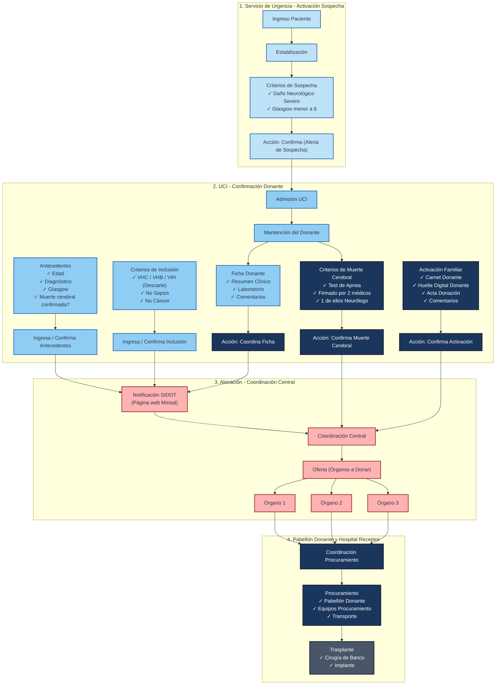

# Transcripción y Análisis Detallado: Presentación UC - TRASPLAN

Este documento contiene la transcripción íntegra del texto y la descripción exhaustiva de los elementos visuales, diagramas de flujo y maquetas (mockups) de la presentación oficial del proyecto **TrasPlan**.

Las diapositivas originales renderizadas como imágenes se encuentran en el directorio: `trasplan_presentation/` (ej. `page-01.png` a `page-14.png`).

---

## Diapositiva 1: Portada y Presentación de la Plataforma

### Contenido Textual
* **Logo:** `TRASPLAN` (Icono de infinito / lazo entrelazado dentro de un cuadrado redondeado).
* **Título principal:** `TrasPlan App`
* **Subtítulo:** `Mobile & Desktop`

### Descripción Visual e Interpretación
* **Fondo:** Una fotografía con un filtro azul/índigo oscuro que muestra a una persona escribiendo en una computadora portátil.
* **Maqueta en Pantalla:** En la pantalla difuminada de la laptop se aprecia el diseño de la interfaz web de escritorio de TrasPlan:
  * Un panel lateral izquierdo (Sidebar) con secciones como `HOME`, `SOSPECHAS`, `USUARIOS`, `DROGAS`, `ORGANOS`, `HOSPITALES`.
  * Una tarjeta de sospecha activa para un paciente con RUT ficticio `82.059.602-K`, ingresado por el "Dr. Hernán Briones", junto con un botón rojo para "Desestimar".
  * Una línea de tiempo que representa el estado del donante: `SOSPECHA -> ACTIVO -> CONFIRMANDO -> BUSCANDO -> CRUZE`.
  * Secciones expandibles del flujo clínico: `CRITERIOS DE INCLUSIÓN` (con indicador de estado verde), `FICHAS MÉDICAS`, `MUERTE CEREBRAL`, y `ACTIVACIÓN FAMILIAR`.
* **Composición:** El logo de TrasPlan se ubica a la izquierda y el título a la derecha de una línea divisoria vertical punteada.

*Referencia de imagen:* `trasplan_presentation/page-01.png` o `trasplan_presentation/images/page_1_img_1.jpeg`

---

## Diapositiva 2: Problemas en el Proceso de Donación

### Contenido Textual
* **Título:** `Problemas en el proceso de donación….`
* **Esquema de fases:**
  * `Detección`
  * `Evaluación`
  * `Diagnóstico ME`
  * `Consentimiento`
  * `Mantenimiento`
  * `Activación de equipos de procura`
  * `Coordinación de traslado`
  * `Documentos legales`
  * `Tiempo de traslado`
  * `Cirugía de procura`
  * `Tiempo de isquemia`
  * `Información limitada`
  * `Trasplante`
* **Sección de Autoridades:**
  * `Autoridades`
  * `- Cirujanos de trasplante`
  * `- Enfermeras de coordinación local`
  * `- Enfermeras de coordinación central`
  * `- Coordinación central`

### Descripción Visual e Interpretación
* **Diagrama de Proceso:** Muestra una línea de tiempo del proceso de donación dividido en tres etapas principales delimitadas por recuadros de colores:
  1. **Detección (Recuadro rojo punteado):** Agrupa la sospecha inicial, la evaluación del paciente, el diagnóstico de muerte encefálica (ME) y la solicitud de consentimiento familiar. Es la fase inicial crítica.
  2. **Mantenimiento (Recuadro azul redondeado):** Muestra el proceso de preservación del donante y los problemas logísticos. Se destaca una flecha horizontal que representa el tiempo. Sobre esta flecha se ubican tareas como "Activación de equipos de procura", "Coordinación de traslado" y "Documentos legales". Abajo se ilustra la duración del "Tiempo de traslado" (barra azul) y el "Tiempo de isquemia" (barra morada) que corre en paralelo. Al final de esta fase está la "Cirugía de procura", y una línea vertical naranja de alerta señala que en este punto existe "Información limitada" (falta de comunicación en tiempo real sobre el estado del órgano/cirugía).
  3. **Trasplante (Recuadro verde redondeado):** La fase final donde se realiza el implante en el receptor.
* **Bloque de Autoridades:** Se conecta con una flecha hacia abajo desde el mantenimiento, indicando que las autoridades y coordinadores (locales, centrales y cirujanos) sufren por la falta de sincronización y visibilidad en esta etapa intermedia.

*Referencia de imagen:* `trasplan_presentation/page-02.png` o `trasplan_presentation/images/page_2_img_1.png`

---

## Diapositiva 3: Concepto de Innovación / Solución Interdisciplinaria

### Contenido Textual
* *Sin texto (Slide conceptual).*

### Descripción Visual e Interpretación
* **Gráfico Central:** Muestra un icono de tres personas (equipo multidisciplinario) en color negro. Sobre la cabeza de la persona del centro hay un icono de ampolleta con un rayo, simbolizando una idea innovadora, co-diseño e interdisciplina.
* **Detalles Estéticos:** Fondo blanco limpio con elementos abstractos de acento: un arco azul punteado en la parte superior derecha, un círculo sólido de color morado en la esquina inferior derecha, y un pequeño icono de mouse de computadora a la izquierda.

*Referencia de imagen:* `trasplan_presentation/page-03.png`

---

## Diapositiva 4: Declaración de Misión de la Plataforma

### Contenido Textual
* **Logo:** `TRASPLAN`
* **Declaración:** `Una plataforma para optimizar, agilizar y facilitar el proceso de donación de órganos en Chile.`

### Descripción Visual e Interpretación
* **Diseño:** Diapositiva dividida en dos columnas. La columna izquierda tiene un fondo azul oscuro sólido con el logo de TrasPlan en blanco. La columna derecha contiene la declaración de la misión en texto azul/negro sobre fondo blanco, con tipografía limpia y espaciada.

*Referencia de imagen:* `trasplan_presentation/page-04.png` o `trasplan_presentation/images/page_4_img_1.jpeg`

---

## Diapositiva 5: Análisis Detallado del Problema y Flujo Clínico

### Contenido Textual
* **Título:** `Análisis del problema`
* **Cronología de Servicios (Fila Superior):** `Servicio de Urgencia` | `UCI` | `Pabellón donante` | `Hospital receptor`
* **Flujo del Donante:** `Ingreso Paciente` -> `Estabilización` --(Traslado)--> `UCI` --(Diagnóstico de Muerte Cerebral)--> `Mantención del donante` ----> `Procuramiento` --(Traslado)--> `Implante`
* **Cajas de Validación y Botones de Acción (Checklists):**
  * **Criterios de Sospecha (Médico General/Urgencia):** `✓ Daño Neurológico Severo`, `✓ Glasgow <8` -> Botón `Confirma` (Ley de notificación de potencial donante).
  * **Antecedentes (Médico UCI):** `✓ Edad`, `✓ Diagnóstico`, `✓ Glasgow`, `✓ Muerte cerebral confirmada?` -> Botón `Confirma`.
  * **Criterios de Inclusión (Médico UCI):** `✓ VHC`, `✓ VHB`, `✓ VIH`, `✓ No Sepsis`, `✓ No Cáncer` -> Botón `Confirma`.
  * **Criterios de Muerte Cerebral (Médico UCI):** `✓ Test de Apnea`, `✓ Firmado por 2 médicos`, `✓ 1 de ellos Neurólogo` -> Botón `Confirma`.
  * **Ficha Donante (Coordinación Local Donante):** `✓ Resumen Clínico`, `✓ Comentarios`, `✓ Laboratorio` -> Botón `Coordina`.
  * **Activación Familiar (Coordinación Local Donante):** `✓ Carnet Donante`, `✓ Huella Digital Donante`, `✓ Acta Donación`, `✓ Comentarios...` -> Botón `Confirma`.
* **Entidades Externas e Integraciones:**
  * `Notificación SIDOT (página web Minsal)`
  * `Coordinación Central`
  * `Órganos a Donar` -> `Oferta` -> `Órgano 1`, `Órgano 2`, `Órgano 3`
  * `Coordinación Procuramiento` (Fase bajo "Tiempo de isquemia")
* **Acciones en Pabellón y Receptor:**
  * **Procuramiento:** `✓ Pabellón Donante`, `✓ Equipos Procuramiento`, `✓ Transporte`
  * **Trasplante:** `✓ Cirugía de Banco`, `✓ Implante`
* **Leyenda de Colores (Roles de Ingreso de Datos):**
  * Celeste: `Cualquier Médico`
  * Azul medio: `Médico UCI`
  * Azul oscuro: `Coordinación local donante`
  * Rojo: `Coordinación Central`
  * Con líneas diagonales azul/rojo: `Coordinación Local Receptor`

### Diagrama Mermaid de la Diapositiva 5 (Análisis del Problema)

### Descripción Visual e Interpretación
Este diagrama representa el **modelo conceptual de dominio** que resuelve TrasPlan, mapeando cada paso clínico y administrativo en la línea de tiempo:
1. **Activación de Sospecha (Celeste):** Se inicia en el Servicio de Urgencias cuando un paciente ingresa con daño neurológico y Glasgow <8 (notificación obligatoria por ley).
2. **Confirmación del Donante (Azul Medio e Involucrados UCI):** El paciente es trasladado a la UCI. Se evalúan los Antecedentes, Criterios de Inclusión (descartando infecciones o cáncer) y Criterios de Muerte Cerebral formal.
3. **Ficha y Activación Familiar (Azul Oscuro - Coordinación Local):** Se registra la ficha del donante y se realiza la entrevista familiar para firmar el acta de consentimiento de donación.
4. **Alocación (Rojo - Coordinación Central):** La información se notifica al sistema central del Minsal (SIDOT) y el Coordinador Central genera las ofertas secuenciales de órganos a los centros médicos.
5. **Procuramiento y Trasplante (Líneas diagonales - Equipos de Extracción y Receptores):** Se gestiona el pabellón, se trasladan los cirujanos, y comienza el tiempo de isquemia del órgano hasta que se implanta con éxito.

*Referencia de imagen:* `trasplan_presentation/page-05.png` o `trasplan_presentation/images/page_5_img_1.png`

---

## Diapositiva 6: Objetivos del Proyecto

### Contenido Textual
* **Título:** `Objetivos`
* **Lista de objetivos:**
  1. `Aumentar la detección y notificación de potenciales donantes.`
  2. `Mejorar la gestión y centralización de la información del donante.`
  3. `Optimizar la comunicación entre los distintos participantes de equipos multidisciplinarios.`
  4. `Ajustar tiempos de traslado y geolocalización de los órganos.`

### Descripción Visual e Interpretación
* **Diseño:** Diapositiva de texto limpio con los cuatro objetivos enumerados en una fuente sans-serif legible, alineados a la izquierda. Un diseño minimalista que destaca la propuesta de valor del proyecto.

*Referencia de imagen:* `trasplan_presentation/page-06.png`

---

## Diapositiva 7: Historial de Desarrollo de la Plataforma (Línea de Tiempo)

### Contenido Textual
* **Título:** `Desarrollo de la plataforma`
* **Línea de tiempo:**
  * **2020 - Etapa I:** `Concurso Interdisciplina VRI UC. Dr. Briceño / Dr. Achurra / Dr. Neyem / Riveros`
  * **2021 - Etapa II:** `Curso Capstone 2021. Escuela de Ingeniería UC. - Sospecha - Activación de donante`
  * **2022 - Etapa III:** `Curso Capstone 2022. Escuela de Ingeniería UC. - Alocación de órganos. - Gestión de procura.`
  * **2022 - Etapa IV:** `FONIS 2022 (No adjudicado) / FONIS 2023 (No adjudicado)`
  * **2023–2024 - Etapa V:** `Completar desarrollo informático.`

### Descripción Visual e Interpretación
* **Diagrama de Línea de Tiempo:** Se presenta mediante una línea horizontal central de color gris con cinco hitos marcados con círculos de colores (naranja, ocre, verde claro, verde oscuro, y verde brillante). Cada hito tiene bloques de texto ubicados alternadamente arriba y abajo de la línea de tiempo, facilitando la lectura cronológica del desarrollo interdisciplinario entre la Escuela de Medicina y la Escuela de Ingeniería de la UC.

*Referencia de imagen:* `trasplan_presentation/page-07.png`

---

## Diapositiva 8: Maquetas y Vistas de Interfaces de Usuario (Mobile y Web)

### Contenido Textual
* **Pantalla Móvil (Izquierda):**
  * `TRASPLAN` (Logo)
  * Botón central con signo de exclamación `!`
  * `Botón para hacer un levantamiento de sospecha`
  * `70% Lorem Ipsum`, `76% Lorem Ipsum`, `52% Lorem Ipsum`, `49% Lorem Ipsum` (Indicadores de progreso)
* **Consola Web (Derecha):**
  * `TRASPLAN` (Sidebar con opciones: `HOME`, `SOSPECHAS`, `USUARIOS`, `CIRUGIAS`, `ORGANOS`, `HOSPITALES`, `TUTORIALES DE USO`, `SALIR`)
  * `Hola Admin...`
  * Ficha de Paciente: `82.059.602-K | Juan Patricio Rivera Perez`
  * Creador: `Dr. Hernán Briones | Pauta de sospecha de donante de órganos por diagnóstico muerte cerebral.`
  * Flujo de estados: `SOSPECHA -> ACTIVO -> CONFIRMADO -> ALOCACION -> CIRUGIA`
  * Botón: `Desestimar` (Rojo)
  * Feed de Actividades (Izquierda): Lista cronológica que detalla "Confirmación de criterios de inclusión | Olivia Nuñez | Hoy 19:58 hrs."
  * Formularios Clínicos (Derecha):
    * Paneles expandibles: `ANTECEDENTES` (Verificado), `FICHAS MÉDICAS` (Verificado), `MUERTE CEREBRAL` (Verificado), `ACTIVACIÓN FAMILIAR` (Verificado).
    * Panel Abierto: `CRITERIOS DE INCLUSIÓN` (Ingresados por: Olivia Nuñez, Confirmado por: Pendiente. Checklist: `VIH` ✓, `VHB` ✓, `VHC` ✓, `Sepsis` ✗, `Cáncer` ✓, `Otros` ☐. Comentarios... Botones `Modificar` y `Confirmar`).

### Descripción Visual e Interpretación
* **Interfaz de la App Móvil:** Diseñada para uso rápido en terreno (médicos de urgencia o UCI). Destaca un gran botón redondo de pánico/alerta central para levantar sospechas de forma instantánea.
* **Interfaz del Panel Web (Desktop):** Diseñada para la gestión centralizada por parte de coordinadores y administradores. Permite visualizar el flujo de estado de la sospecha, auditar las acciones del personal clínico mediante la sección de "Actividades", y validar los cinco formularios médicos requeridos para confirmar un donante. Se muestra claramente el checklist de descarte de infecciones y condiciones médicas inviables.

*Referencia de imagen:* `trasplan_presentation/page-08.png` o `trasplan_presentation/images/page_8_img_1.jpeg`

---

## Diapositiva 9: Características Generales - Intervención y Gestión

### Contenido Textual
* **Título:** `Características generales`
* **Punto 1:** `1. Permite intervenir en todas las etapas del proceso de donación.`
  * `> Notificación de potencial donante.`
  * `> Gestión de la información de manera centralizada.`
  * `> Optimiza la comunicación entre equipos.`
  * `> Geolocalización y tiempos.`

### Descripción Visual e Interpretación
* **Diseño:** Columna de texto a la izquierda detallando el primer punto de características generales. En la esquina inferior derecha se muestra una miniatura del panel web de administración para ilustrar de forma visual cómo se ve el sistema centralizado.

*Referencia de imagen:* `trasplan_presentation/page-09.png` o `trasplan_presentation/images/page_9_img_1.jpeg`

---

## Diapositiva 10: Características Generales - Seguridad y Roles

### Contenido Textual
* **Título:** `Características generales`
* **Punto 1 y 2:**
  * `1. Permite intervenir en todas las etapas del proceso de donación.`
    * `Notificación de potencial donante.`
    * `Gestión de la información de manera centralizada.`
    * `Optimiza la comunicación entre equipos.`
    * `Geolocalización y tiempos.`
  * `2. Sistema seguro y encriptado.`
    * `> Credenciales de activación.`
    * `> Privilegios según usuarios.`
    * `> Registro de actividad.`

### Descripción Visual e Interpretación
* **Diseño:** Amplía la lista de características agregando el punto 2 sobre la seguridad de los datos clínicos. A la derecha, muestra una maqueta tridimensional de una computadora portátil (MacBook) con la pantalla encendida mostrando la consola web de TrasPlan.

*Referencia de imagen:* `trasplan_presentation/page-10.png` o `trasplan_presentation/images/page_10_img_1.jpeg`

---

## Diapositiva 11: Características Generales - Módulo de Estadísticas

### Contenido Textual
* **Título:** `Características generales`
* **Punto 3:** `3. Estadísticas`
  * `> Demográficas regionales`
  * `> Centro asistencial`
  * `> Tiempos y traslados.`

### Descripción Visual e Interpretación
* **Diseño:** Diapositiva que introduce el módulo de estadísticas de la plataforma. A la derecha, muestra una maqueta de un iPhone de color negro en posición vertical donde se visualiza la pantalla del botón de activación de la aplicación móvil de TrasPlan.

*Referencia de imagen:* `trasplan_presentation/page-11.png` o `trasplan_presentation/images/page_11_img_1.jpeg`

---

## Diapositiva 12: Características Generales - Herramientas Adicionales

### Contenido Textual
* **Título:** `Características generales`
* **Puntos 3 y 4:**
  * `3. Estadísticas` (Demográficas regionales, Centro asistencial, Tiempos y traslados).
  * `4. Herramientas adicionales`
    * `> Educación sobre donación para profesionales.`
    * `> Guías clínicas para mantención de donantes.`
    * `> Información para profesionales sobre apoyo a familiares.`

### Descripción Visual e Interpretación
* **Diseño:** Extiende la lista anterior introduciendo las herramientas de apoyo clínico y educacional para los profesionales que acompañan a las familias y mantienen al donante estable en la UCI. Mantiene a la derecha el mockup del iPhone con la interfaz de la aplicación móvil.

*Referencia de imagen:* `trasplan_presentation/page-12.png` o `trasplan_presentation/images/page_12_img_1.jpeg`

---

## Diapositiva 13: Características Generales - Disponibilidad Multiplataforma

### Contenido Textual
* **Título:** `Características generales`
* **Puntos 3, 4 y 5:**
  * `3. Estadísticas`
  * `4. Herramientas adicionales`
  * `5. Disponible en Mobile y Desktop, para Android y iOS.`

### Descripción Visual e Interpretación
* **Diseño:** Muestra la lista final de características generales, agregando el punto 5 que confirma el soporte multiplataforma nativo. Mantiene el mockup del smartphone en el costado derecho.

*Referencia de imagen:* `trasplan_presentation/page-13.png` o `trasplan_presentation/images/page_13_img_1.jpeg`

---

## Diapositiva 14: Cierre y Aplicación del Logo

### Contenido Textual
* **Texto de la maqueta:**
  * `05 | Mockup Logo Aplicado`
  * `Diseño Logo`
  * `TrasPlan App`

### Descripción Visual e Interpretación
* **Visual:** Una fotografía en primer plano que muestra unas manos sosteniendo un iPhone de color blanco. En la pantalla del dispositivo se observa la cuadrícula de iconos de iOS 8 (Salud, Passbook, Ajustes, App Store, Safari, etc.). En medio de la segunda fila resalta un icono personalizado con fondo azul brillante y el logotipo en color blanco (cuadrado redondeado con el lazo infinito de TrasPlan), etiquetado con el nombre `TrasPlan`.
* **Propósito:** Mostrar la aplicación práctica y la identidad visual de marca de la aplicación móvil en un entorno real.

*Referencia de imagen:* `trasplan_presentation/page-14.png` o `trasplan_presentation/images/page_14_img_1.jpeg`
