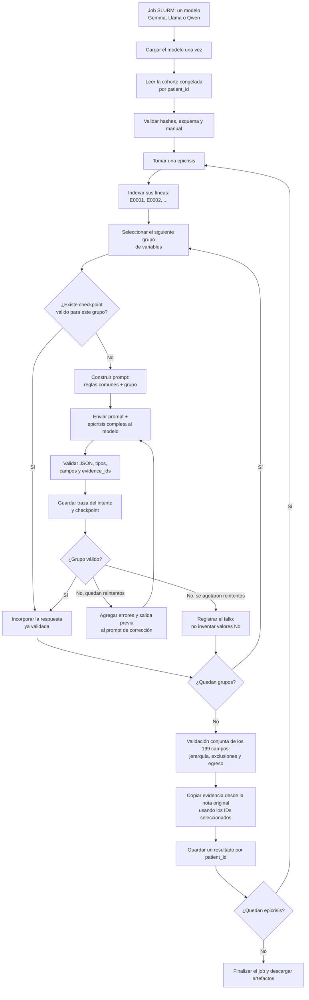
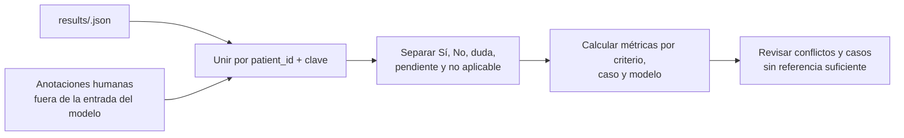

# Estrategia de prompting para la extracción clínica

Este documento describe la estrategia `form199-v1`, diseñada para comparar la
extracción de tres modelos de lenguaje con las anotaciones humanas de la
aplicación de epicrisis. La estrategia está pensada para ejecutarse en Cóndor
con SLURM y deja cada decisión trazable y reanudable.

## Qué problema resuelve

La aplicación tiene 199 variables finales. Pedirlas todas en una sola llamada
produce respuestas largas, truncamientos y errores difíciles de localizar.
Por eso el formulario se divide en 18 grupos de hasta 16 variables. Cada grupo
conserva sus claves, etiquetas, tipos, opciones, relaciones jerárquicas y
exclusiones tomadas del formulario de la aplicación.

La división no cambia la tarea clínica: cada llamada recibe la epicrisis
completa. Solo cambia el subconjunto de variables que debe devolver. Así el
modelo puede leer el contexto necesario sin tener que generar las 199
respuestas en una sola salida.

## Flujo completo



## Cómo se construye cada llamada

Cada llamada usa tres piezas:

```text
common.md
  + definición de las variables del grupo
  + epicrisis completa con líneas numeradas
  = prompt enviado al modelo
```

`common.md` fija las reglas que deben ser iguales para todos los grupos:

- primera estadía en UCI;
- separación entre antecedentes, ingreso, soporte, fallas, infecciones,
  complicaciones y egreso;
- `true` para Sí, `false` para No y `unknown` para una duda real;
- evidencia obligatoria para Sí y duda;
- niveles de incertidumbre `Alto`, `Bajo` o `Indeterminado`;
- respeto de fechas, opciones de selección, relaciones padre-hijo y campos
  mutuamente excluyentes.

La epicrisis se entrega con líneas como `[E0042] ...`. El modelo no redacta la
evidencia: devuelve `evidence_ids`. Después de validar esos IDs, el programa
copia el texto original y conserva sus offsets. Esto evita que el modelo
parafrasee o invente citas.

## Qué ocurre cuando una respuesta falla

La respuesta se valida inmediatamente contra el grupo solicitado. Se revisa:

1. que estén todas las claves del grupo y no haya claves extra;
2. que cada valor tenga la estructura exacta;
3. que los tipos y las opciones sean válidos;
4. que los `evidence_ids` existan en la epicrisis;
5. que Sí y duda tengan evidencia;
6. que la duda tenga un nivel de incertidumbre.

Si falla, el siguiente intento recibe el detalle de los errores y la respuesta
anterior. Puede haber hasta dos reintentos. Un grupo que sigue inválido no se
convierte automáticamente en No: queda registrado como incompleto y el caso
final se marca `valid=false`.

## Checkpoints y reanudación

Cada grupo validado se guarda inmediatamente. El checkpoint incluye una firma
calculada con la versión del protocolo, el código del runner, el modelo, el
`patient_id`, el texto y la configuración de generación. Si el proceso se
interrumpe, se puede reanudar sin repetir los grupos ya válidos. Si cambia
cualquiera de esos elementos, la firma deja de coincidir y se debe usar una
nueva carpeta de resultados.

Existe además un bloqueo por modelo y carpeta de salida para evitar que dos
jobs escriban el mismo experimento al mismo tiempo.

## Artefactos generados

Para cada modelo, la carpeta de resultados tiene esta forma:

```text
<modelo>/
├── .run.lock
├── checkpoints/
│   └── <patient_id>/
│       ├── antecedentes_01.json
│       ├── soporte_01.json
│       └── traces/
│           ├── antecedentes_01_<timestamp>.json
│           └── ...
└── results/
    └── <patient_id>.json
```

Una traza conserva el prompt exacto, el intento, la respuesta cruda, los
errores de validación y las métricas de inferencia. El checkpoint conserva el
último intento del grupo. El JSON de `results` reúne los grupos, registra la
validez global y agrega las evidencias copiadas desde la nota original.

## Qué significa el resultado final

El resultado primario del runner es un JSON por combinación de modelo y
`patient_id`. Con 50 epicrisis y tres modelos se esperan hasta 150 archivos.
`valid=true` significa que la salida cumple el contrato estructural y las
relaciones del formulario; no significa que la decisión clínica sea correcta.

La comparación con anotadores ocurre después, en una etapa separada:



No se debe calcular una métrica mezclando `unknown` con `false`, ni tratar un
caso sin anotación humana como un No. Las anotaciones individuales también
deben distinguirse de un consenso adjudicado.

## Archivos de implementación

La versión ejecutable está en
`proyecto_sotero_ihealth/LLM-extraction/extraction-condor/form199_v1/`:

- `prompts/common.md`: reglas compartidas;
- `prompts/*.md`: prompts generados para cada grupo;
- `protocol.py`: catálogo, grupos, evidencia y validación;
- `runner.py`: llamadas, reintentos, checkpoints y consolidación;
- `config.json`: cohorte, modelos y carpeta de salida;
- `run.slurm.sh`: reserva de recursos y lanzamiento en SLURM.

La estrategia no mezcla los resultados de los experimentos antiguos de 48
campos. Es una versión nueva y versionada para el formulario actual de 199
variables.
