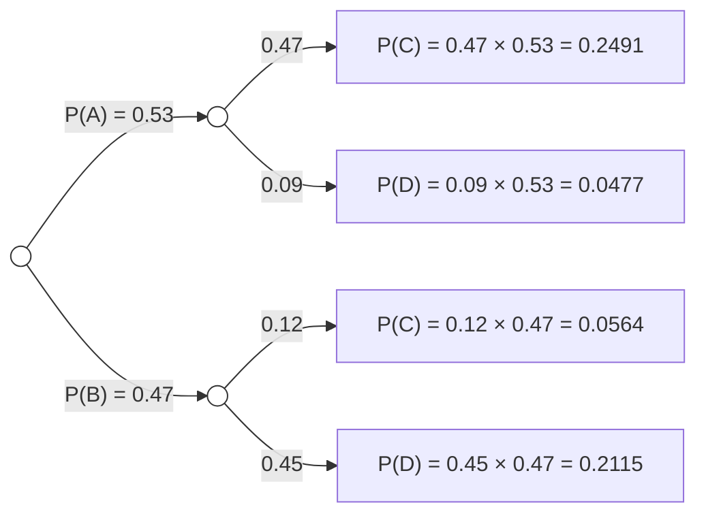
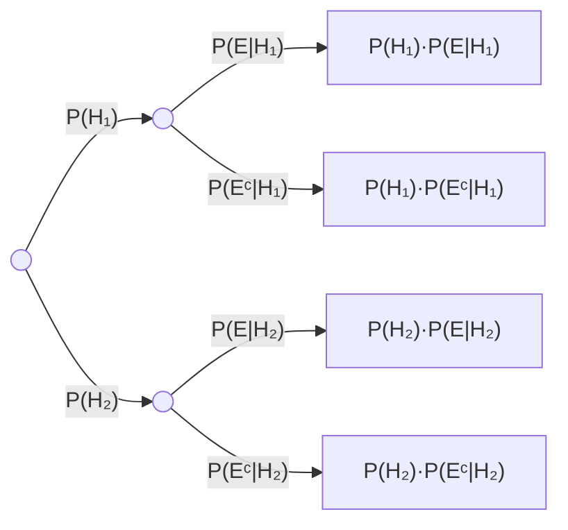
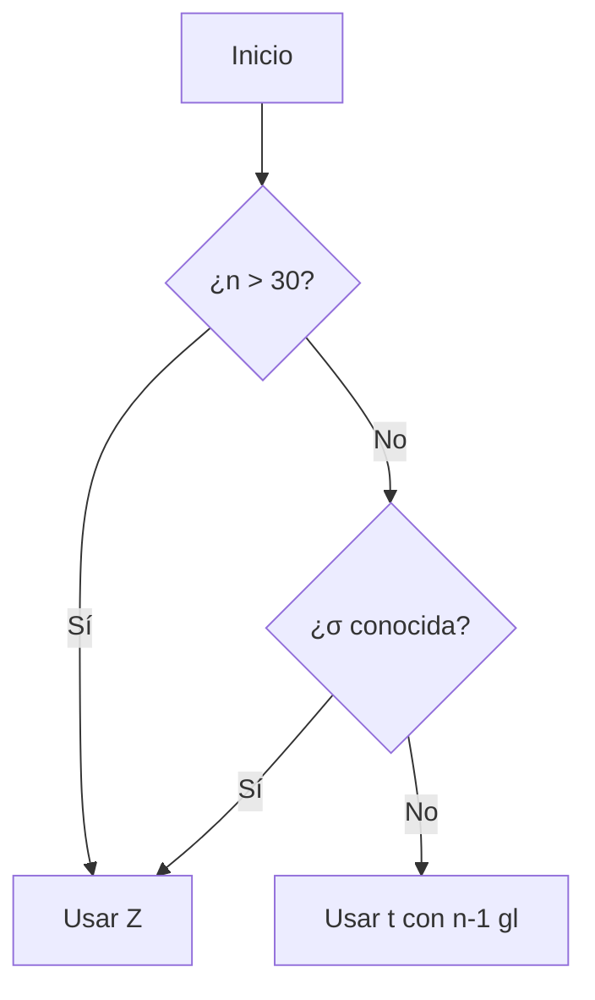

# Mermaid Diagram

## When to use this skill

Use instead of TikZ when the diagram is:
- **Árbol de probabilidad** (probability tree with branches and multiplied values)
- **Diagrama de flujo** de un proceso o algoritmo
- **Diagrama de secuencia** o de estados
- Any tree/hierarchy that would require complex TikZ positioning

**Keep using TikZ for**: Venn diagrams, boxplots, histograms, coordinate-based plots. TikZ is better when you need precise geometric control.

---

## Tool Requirements

Check availability before running:
```bash
which mmdc
```

If missing: `npm install -g @mermaid-js/mermaid-cli` or it may be at `~/.local/bin/mmdc`.

Also needed for PNG → LaTeX embedding: `\usepackage{graphicx}` in the LaTeX preamble (handled by `latex-writer`).

---

## Execution Protocol

### Step 1 — Write the .mmd file

Write the Mermaid source to a temporary file. Choose the diagram type that fits:

**Árbol de probabilidad (graph LR)**:


**Tips for árbol de probabilidad**:
- Root and intermediate nodes: `(( ))` for circles
- Leaf nodes: `["text"]` for rectangles showing the product
- Edge labels: `|"P(X|Y) = val"| ` — use quotes to allow special chars
- Direction: `LR` (left to right) works best for probability trees
- Keep leaf text short: just the product, e.g. `"0.47 × 0.53 = 0.2491"`

### Step 2 — Generate PNG

```bash
mmdc -i {input.mmd} -o {output_dir}/figures/{name}.png \
     -w 900 -H 500 --backgroundColor white
```

- `-w` and `-H`: width and height in pixels. Adjust for the number of branches.
  - 2-branch tree: `-w 800 -H 350`
  - 3-branch tree per node: `-w 900 -H 500`
  - 4+ branches: `-w 1000 -H 650`
- `--backgroundColor white`: ensures clean white background for embedding
- Output goes into `{root}/output/figures/` so the path is clean relative to the `.tex`

Verify output:
```bash
ls -lh {output_dir}/figures/{name}.png
```

### Step 3 — Embed in LaTeX

Pass to `latex-illustrator` (or write directly if called standalone):

```latex
\begin{figure}[H]
  \centering
  \includegraphics[width=0.82\textwidth]{figures/{name}.png}
\end{figure}
```

Width guidelines:
- Simple 2-level tree: `0.65\textwidth`
- 3-level tree (root → 2 nodes → 3 leaves each): `0.82\textwidth`
- Very wide tree: `\textwidth`

The `figures/` path is relative to the `.tex` file — ensure both live in the same `output/` directory.

---

## LaTeX Preamble Requirements

The LaTeX document must have:
```latex
\usepackage{graphicx}
\usepackage{float}
```

`latex-writer` includes these by default.

---

## Common Mermaid Patterns

### Árbol de probabilidad total (Bayes setup)


### Flowchart de decisión


---

## Constraints

- **No usar para Venn, boxplot, histograma** — esos van en TikZ.
- **Siempre fondo blanco** (`--backgroundColor white`) para que el PNG integre limpio en el PDF.
- **El PNG va en `output/figures/`** — nunca directamente en `output/` para mantener el directorio limpio.
- **No editar el PNG** — si el diagrama queda mal, regenerar el `.mmd` y volver a compilar.
- **Registrar el bug de `\fi`**: en TikZ, nunca usar `\fi`, `\else`, `\if` como nombres de variables en `\foreach` — son primitivas TeX reservadas. Usar `\fabs`, `\fval`, `\fnum`, etc.
